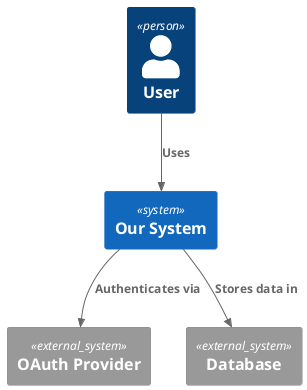
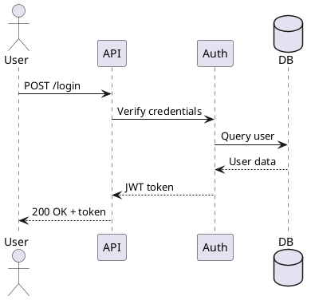
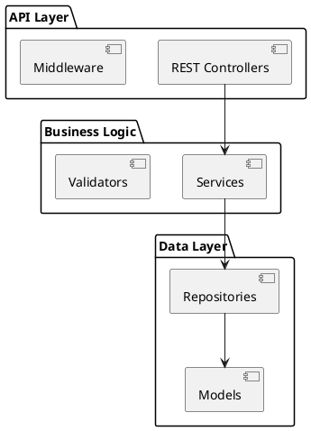

# Systems Engineering Skill

**Workflow Capability**: Apply INCOSE V-model methodology to software projects—gathering requirements, designing architecture, implementing with validation gates, and verifying against specifications. Prevents late-stage integration failures through systematic de-risking.

## When This Skill Activates

- Requirements gathering/analysis
- System architecture design
- Integration planning
- Validation strategy definition
- Verification workflows
- Risk mitigation planning

## INCOSE V-Model Overview

```
Requirements ─────┐                    ┌───── Acceptance Testing
   ↓              │                    │         ↑
System Design ────┤                    ├───── System Testing
   ↓              │                    │         ↑
Architecture ─────┤    Implementation  ├───── Integration Testing
   ↓              │         ↓          │         ↑
Detailed Design ──┤         ↓          ├───── Unit Testing
   ↓              │         ↓          │         ↑
Coding ←──────────┘         ↓          └────────┘
                            ↓
                     [Continuous Validation]
```

**Left side (Decomposition)**: Requirements → Design → Implementation
**Right side (Integration)**: Testing → Verification → Validation
**Key insight**: Each left element has corresponding right validation

## Core Phases

### Phase 1: Requirements (Left V)

**Capture what, not how:**
```plaintext
✅ "System SHALL authenticate users via OAuth2"
✅ "Response time SHALL be <200ms for 95th percentile"
❌ "Use PostgreSQL for user storage" (implementation detail)
```

**Traceability:**
```
REQ-001: User authentication
  ├─ DESIGN-001: OAuth2 architecture
  │   ├─ IMPL-001: JWT token service
  │   └─ TEST-001: Token validation tests
  └─ ACCEPT-001: End-to-end auth flow test
```

### Phase 2: System Design (Left V)

**Architecture decisions:**
- Component boundaries
- Communication patterns
- Data models
- Technology choices (justified)

**PlantUML:**


### Phase 3: Detailed Design (Left V)

**Interface specifications:**
```yaml
# OpenAPI spec
/users/{id}:
  get:
    parameters:
      - name: id
        in: path
        required: true
        schema:
          type: string
    responses:
      200:
        description: User found
      404:
        description: User not found
```

### Phase 4: Implementation (Bottom V)

**Code with traceability:**
```rust
// IMPL-001: JWT token service (traces to DESIGN-001, REQ-001)
pub struct TokenService {
    secret: String,
}

impl TokenService {
    // TEST-001 validates this
    pub fn validate(&self, token: &str) -> Result<Claims, Error> {
        // ...
    }
}
```

### Phase 5: Unit Testing (Right V)

**Test each implementation:**
```rust
#[test]
fn test_token_validation() {  // TEST-001
    let service = TokenService::new("secret");
    let token = service.generate_token("user123");

    let claims = service.validate(&token).unwrap();
    assert_eq!(claims.sub, "user123");
}
```

### Phase 6: Integration Testing (Right V)

**Test component interactions:**
```typescript
describe('API Integration', () => {
  it('should authenticate and fetch user', async () => {  // INT-001
    const token = await auth.login('user@example.com', 'pass');
    const user = await api.getUser(token);
    expect(user.email).toBe('user@example.com');
  });
});
```

### Phase 7: System Testing (Right V)

**Test complete system:**
```bash
# SYS-001: End-to-end flow
just test-e2e

# Validates:
# - Authentication works
# - API responds correctly
# - Database persists data
# - Response times meet REQ-002 (<200ms)
```

### Phase 8: Acceptance Testing (Right V)

**Validate requirements met:**
```gherkin
# ACCEPT-001: Traces to REQ-001
Feature: User Authentication
  Scenario: User logs in successfully
    Given a registered user
    When they provide valid credentials
    Then they receive a valid JWT token
    And the token grants access to protected resources
```

## De-Risking Strategy

### Early Validation Gates

**Gate 1: Requirements Review**
```bash
# Before any design
just validate-requirements

# Checks:
- Requirements are testable
- No contradictions
- Traceability established
- Stakeholder sign-off
```

**Gate 2: Architecture Review**
```bash
# Before detailed design
just review-architecture

# Checks:
- Components well-defined
- Interfaces specified
- Non-functional requirements addressed
- Risk assessment complete
```

**Gate 3: Interface Verification**
```bash
# Before implementation
just verify-interfaces

# Checks:
- API contracts defined (OpenAPI)
- Data models specified
- Error handling planned
- Mocks available for testing
```

**Gate 4: Implementation Review**
```bash
# During coding
just review-code

# Checks:
- Unit tests pass
- Code review completed
- Traceability maintained
- Technical debt documented
```

**Gate 5: Integration Checkpoint**
```bash
# Before system test
just verify-integration

# Checks:
- All components integrate
- Integration tests pass
- Performance baselines met
- Known issues documented
```

**Gate 6: System Validation**
```bash
# Before acceptance
just validate-system

# Checks:
- All requirements verified
- System tests pass
- Non-functional requirements met
- Documentation complete
```

### Risk Matrix

```
Risk = Probability × Impact

High Risk (P>0.7, I>7):
  → Address in Phase 1-2 (requirements/design)
  → Create mitigation plan
  → Early prototyping/PoC

Medium Risk (P>0.4, I>4):
  → Address in Phase 3-4 (design/implementation)
  → Monitoring strategy

Low Risk (P<0.4, I<4):
  → Standard development process
```

## PlantUML Patterns

### Pattern 1: System Context



**Save to:** `docs/architecture/context.puml`
**Generate:** `plantuml docs/architecture/context.puml`

### Pattern 2: Sequence Diagram



### Pattern 3: Component Diagram



## Traceability Matrix

```markdown
| Requirement | Design | Implementation | Test | Status |
|------------|--------|----------------|------|--------|
| REQ-001    | DESIGN-001 | IMPL-001   | TEST-001 | ✅ Pass |
| REQ-002    | DESIGN-002 | IMPL-002   | TEST-002 | 🔄 WIP  |
| REQ-003    | DESIGN-003 | -          | -        | 📋 Planned |
```

**Generate with:**
```bash
just generate-traceability-matrix
```

## Integration with B00t Skills

### With Agent-Orchestration

```typescript
// Phase 1: Requirements (Gemini research)
const reqResearch = await gemini.research({
  query: "OAuth2 authentication best practices 2025",
  output: "requirements/research.md"
});

// Phase 2: Design (Claude architecture)
const architecture = await claude.designSystem({
  requirements: "requirements/req-001.md",
  research: reqResearch
});

// Phase 3: Implementation (Codex generation)
const code = await codex.implement({
  design: architecture,
  tests: "first"  // TDD approach
});

// Phase 4-8: Validation (parallel review)
await every.review({
  pr: "oauth-implementation",
  validators: ["security", "performance", "quality"]
});
```

### With Hive-Memory

```bash
# Capture V-model learnings
b00t lfmf datum abstract <<EOF
Lesson: Integration testing prevents 80% of late-stage bugs

Context: Implemented OAuth without integration tests
Problem: Components worked individually, failed together
Solution: Added integration test suite at Gate 5

Pattern: NEVER skip integration testing phase
Codified: .github/workflows/ci.yml

🤓 Unit tests prove components work. Integration tests prove system works.
EOF
```

### With Devops-Stacks

```bash
# Each stack component has validation
b00t stack compose \
  --with-tests \
  --traceability-matrix \
  --plantuml-docs
```

## Quality Gates Checklist

Before advancing phase:

**Requirements → Design:**
- [ ] All requirements documented
- [ ] Requirements are testable
- [ ] Stakeholder approval
- [ ] Traceability IDs assigned

**Design → Implementation:**
- [ ] Architecture reviewed
- [ ] Interfaces defined (OpenAPI/gRPC)
- [ ] PlantUML diagrams created
- [ ] Risk assessment complete

**Implementation → Testing:**
- [ ] Code review passed
- [ ] Unit tests written & passing
- [ ] Traceability maintained
- [ ] Documentation updated

**Testing → Acceptance:**
- [ ] Integration tests pass
- [ ] System tests pass
- [ ] Performance requirements met
- [ ] Traceability matrix complete

## References

Detailed patterns in `references/`:

- **`v-model-left.md`** - Requirements → Design → Coding
- **`v-model-right.md`** - Testing → Verification → Validation
- **`plantuml-patterns.md`** - Diagram templates
- **`traceability.md`** - Requirements tracing
- **`derisking-gates.md`** - Validation checkpoints

---

*V-model prevents late-stage integration hell. Validate early, integrate incrementally.* 📐
