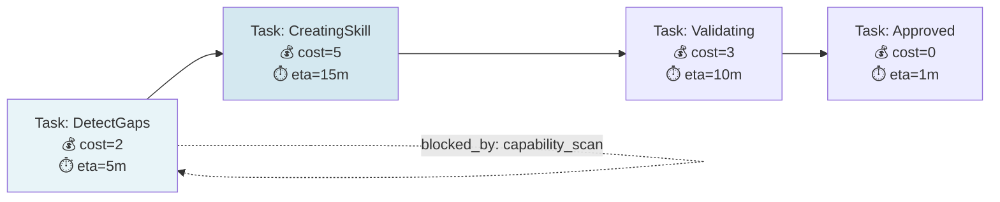

# Deeper b00t ↔ l3dg3rr Integration for Orchestration Visualization

## Executive Summary

**Current State**: b00t and l3dg3rr have baseline schema compatibility (`.tomllmd` format) and isolated integration surfaces. l3dg3rr owns visualization (isometric 3D + Mermaid DSL), but b00t's emerging coordination systems (blessing graph, orchestration DAG, agent messaging) lack visual representation.

**Opportunity**: Reuse l3dg3rr's proven isometric model and Rhai DSL rendering to visualize b00t's orchestration topology—enabling operators to see role hierarchies, cost budgets, task dependencies, and authorization flows in real-time.

**Update 2026-05-03**: PlantUML rendering/queue integration is SUNSET for b00t. Java adds too much runtime weight. Keep PlantUML as legacy source export only; prefer Mermaid, Rhai DSL, and l3dg3rr-shaped SVG/isometric output.

**Proposal**: Five-layer integration strategy from schema extension → rendering pipeline → interactive tooling.

---

## Part I: Current Integration Surfaces & Gaps

### 1.1 Existing Integration Points

| Surface | File | Current Use | Depth |
|---------|------|-------------|-------|
| **Schema Layer** | `.tomllmd` format spec | Format validation, summary tiers | Shallow |
| **Config Authority** | `_b00t_/l3dg3rr.cli.toml` | Capability declaration | Shallow |
| **Validation** | `vendor/l3dg3rr/crates/datum/` | `.tomllmd` parsing + type checking | Medium |
| **Visualization** | `vendor/l3dg3rr/crates/b00t-iface/src/viz/` | Isometric projection (unused by b00t) | **Gap** |
| **DSL Rendering** | `mdbook-rhai-mermaid` | Rhai→Mermaid (finance docs only) | Isolated |
| **MCP Exposure** | `IrontologyMcp.mcp.tomllm` | Semantic queries (read-only) | Shallow |

### 1.2 Visualization Gaps

| b00t System | Data Structure | Current Viz | Gap Severity |
|------------|---|---|---|
| **Blessing Graph** | DAG (nodes=roles, edges=dependencies) | ❌ None | **Critical** |
| **Blessing Constraints** | Cost budgets + role access matrix | ❌ None | **Critical** |
| **Moku State Machines** | States + transitions + guards | ✅ Basic Mermaid | Medium (no isometric option) |
| **Orchestration DAG** | Tasks + dependencies + blocking | ❌ None | **Critical** |
| **Agent Messaging** | Mailbox queues + authorization | ❌ None | High |
| **Entanglement Graph** | Datum cross-references | ✅ Validation only | High |
| **k0mmand3r Guards** | Boolean expressions on transitions | ✅ Inline in Mermaid | Low |

### 1.3 Architectural Friction Points

**Friction 1: Summary Level Semantics Ignored**
- l3dg3rr `.tomllmd` supports `verbatim|executive|epigram` tiers for multi-audience docs
- b00t treats all content as `verbatim`; no tier-aware rendering
- **Impact**: Operators see wall-of-text logs instead of executive summaries

**Friction 2: Visualization Config Missing from `.tomllmd` Spec**
- `.tomllmd` has `[sections.name]` for domain content (financial, workflow)
- **Gap**: No standard `[sections.visualization]` for diagram DSL declarations
- Must be stored separately or inferred heuristically

**Friction 3: Entanglement Visualization Not Integrated**
- `irontology.rs` validates entanglement refs (`datum.type`) with RDF semantics
- l3dg3rr can render entanglement graphs (PRD-9); b00t cannot
- **Impact**: Hidden interdependencies between orchestration datums

**Friction 4: Isometric Model Not Reused**
- l3dg3rr's `VisualizationSpec` trait + `Vec3` projection proven in finance domain
- b00t has Mermaid-only output; no isometric option for complex DAGs
- **Opportunity**: Domain type mapping (BlessingNode → VisualizationSpec)

**Friction 5: PlantUML Queue Configured but Sunset**
- `_b00t_/plantuml-queue.stack.toml` exists for archaeology
- Java/PlantUML renderer is too heavy for the current b00t runtime
- l3dg3rr→Mermaid/SVG is direct; do not add PlantUML queue dispatch

---

## Part II: Integration Strategy

### 2.1 Layer 1: Extend `.tomllmd` Schema

**Goal**: Standardize diagram declarations within datums

**Changes**:

```toml
# Add to vendor/l3dg3rr/crates/datum/src/tomllmd.rs

[sections.visualization]
type = "rhai_dsl"      # "rhai_dsl" | "mermaid" | "plantuml" | "auto"
render_opts = [
  "isometric",         # Render to isometric 3D (if available)
  "mermaid_fallback",  # Fallback to Mermaid if isometric unavailable
  "no_cache",          # Re-render on every read
]
auto_scope = "graph|dag|state_machine"  # Type hint for auto-detection

[[sections.visualization.examples]]
name = "blessing_quorum_flow"
dsl = """
  role(executive, {color: blue, cost: 10}) ->
    role(orchestrator, {color: cyan, cost: 5}) ->
      role(assimilate, {color: green, cost: 3}) ->
  approve() -> done()
"""
```

**b00t Integration** (datum_utils.rs):
- Parse `[sections.visualization]` when loading `.tomllmd`
- Store in `DatumMetadata { visualization_spec: Option<VisualizationSpec> }`
- Fail gracefully if section absent (backward compatible)

**l3dg3rr Integration** (mdbook-rhai-mermaid):
- Extend Rhai parser to recognize visualization sections
- Route to isometric renderer (if `isometric` in `render_opts`)
- Fall back to Mermaid for CI/docs

### 2.2 Layer 2: Blessing Graph Visualization

**Goal**: Render role hierarchy, cost budgets, dependencies as interactive diagram

**Implementation**:

1. **New module**: `b00t-cli/src/blessing/visualization.rs`

```rust
impl BlessingGraph {
    pub fn to_rhai_dsl(&self) -> String {
        // Generate Rhai DSL for isometric rendering
        // nodes: BlessingRole (with cost constraints, access matrix)
        // edges: BlessingDependency (with voting quorum, timeout)
        let mut dsl = String::new();
        for role in &self.roles {
            dsl.push_str(&format!(
                r#"role("{}", {{ cost: {}, depth: {}, access: [...] }})"#,
                role.name, role.cost_budget, role.hierarchy_depth
            ));
        }
        dsl
    }

    pub fn to_mermaid(&self) -> String {
        // For CI/docs (no interactive rendering needed)
    }
}
```

2. **Integrate into blessing datum** (`_b00t_/blessing.step.toml`):

```toml
[sections.visualization]
type = "rhai_dsl"
render_opts = ["isometric", "mermaid_fallback"]
auto_scope = "dag"
```

3. **Interactive viewer** (new):
   - CLI: `b00t blessing viz --graph` → render to image/SVG
   - REPL: `b00t:bless(); blessing.graph.to_viz()` → live output

### 2.3 Layer 3: Orchestration DAG Visualization

**Goal**: Task dependencies, blocking relationships, cost propagation in visual form

**Implementation**:

1. **Extend task module** (`b00t-cli/src/task/mod.rs`):

```rust
impl TaskGraph {
    pub fn to_visualization(&self, format: VizFormat) -> String {
        match format {
            VizFormat::IsometricRhai => self.to_rhai_dsl(),
            VizFormat::Mermaid => self.to_mermaid(),
            VizFormat::PlantUML => self.to_plantuml(),
        }
    }

    fn to_rhai_dsl(&self) -> String {
        // task(id, {status, cost, eta, blocked_by: [...]}) -> task(...)
    }
}
```

2. **Register in visualization spec** (`.tomllmd` extension):

```toml
# _b00t_/task.stack.toml
[sections.visualization]
type = "rhai_dsl"
auto_scope = "dag"
render_opts = ["isometric"]
```

3. **PlantUML queue integration**:

```rust
// b00t-cli/src/viz/plantuml_bridge.rs
pub async fn dispatch_to_queue(dsl: &str) -> Result<SvgOutput> {
    // Query plantuml-queue.stack.toml endpoint
    // POST: {diagram_type: "task_dag", dsl: "..."}
    // GET: {job_id} → /tmp/plantuml-output.svg
}
```

### 2.4 Layer 4: Entanglement Graph Visualization

**Goal**: Visualize datum cross-references, impact analysis, dependency chains

**Implementation**:

1. **Extend irontology-mcp** (new tool):

```rust
// IrontologyMcp → new queries
pub async fn entanglement_graph_viz(
    start_datum: &str,
    scope: EntanglementScope,  // Self | Immediate | Transitive
) -> VisualizationSpec {
    // Query irontology index
    // Build DAG: datum → [entangled_to] → datum
    // Map to VisualizationSpec {nodes, edges, layout_hint}
}
```

2. **New command**:

```bash
b00t entanglement viz blessing.step.toml --scope=transitive
# Output: isometric graph showing:
#   - Direct refs (blue edges)
#   - Transitive impact (faded edges)
#   - Circular deps (red highlight)
```

3. **Interactive mode** (Rhai REPL):

```rust
// In b00t REPL
let graph = irontology.entanglement_graph("blessing.step.toml", "transitive");
graph.render_isometric().show();  // Opens interactive viewer
```

### 2.5 Layer 5: Unified Visualization CLI

**Goal**: Single `b00t viz` command for all systems

**Command Structure**:

```bash
# State machine
b00t viz step recovery/pre-switch-main.step.toml --format=isometric

# Blessing graph
b00t viz blessing --role=executive --depth=3

# Orchestration DAG
b00t viz task --project=<task_id> --show-cost-propagation

# Entanglement
b00t viz entangle --datum=blessing.step.toml --scope=transitive

# Multi-system composite
b00t viz orchestration --all  # blessing + task + agent messaging
```

**Output Formats**:

```
--format=isometric    → Interactive SVG + WASM viewer (l3dg3rr's Vec3 projection)
--format=mermaid      → Markdown diagram block (CI-friendly)
--format=plantuml     → PlantUML DSL → queue dispatch
--format=json         → Structured graph data (for external tools)
--format=ascii        → Terminal rendering (for headless servers)
```

---

## Part III: Implementation Roadmap

### Phase 1: Schema & Foundation (Week 1)
- [ ] Extend `.tomllmd` with `[sections.visualization]` (vendor/l3dg3rr)
- [ ] Add `VisualizationSpec` to b00t-cli datum_utils
- [ ] Integrate l3dg3rr's `Vec3` + `iso_project()` into b00t-cli/src/viz/
- [ ] Write tests for `.tomllmd` parsing → VisualizationSpec

**Deliverable**: b00t can parse and store visualization specs; isometric projection primitives available

### Phase 2: Blessing Graph (Week 2)
- [ ] Implement `BlessingGraph::to_rhai_dsl()` + `to_mermaid()`
- [ ] Add `_b00t_/blessing.step.toml` visualization section
- [ ] CLI: `b00t blessing viz --graph` → file output
- [ ] Tests: snapshot tests for DSL + Mermaid output

**Deliverable**: Operators can visualize role hierarchies, costs, voting quorum

### Phase 3: Task DAG & PlantUML Bridge (Week 3)
- [ ] Implement `TaskGraph::to_visualization()`
- [ ] Build PlantUML queue bridge (dispatch + fetch output)
- [ ] CLI: `b00t task viz --project=<id>`
- [ ] Integration tests with plantuml-queue.stack.toml

**Deliverable**: Task dependencies visible; cost propagation traced visually

### Phase 4: Entanglement & Irontology (Week 4)
- [ ] Extend IrontologyMcp with entanglement graph queries
- [ ] Implement entanglement → VisualizationSpec mapping
- [ ] CLI: `b00t entangle viz <datum> --scope=<scope>`
- [ ] REPL integration

**Deliverable**: Hidden interdependencies exposed; circular deps detected visually

### Phase 5: Unified CLI + Interactive Viewer (Week 5)
- [ ] Implement `b00t viz` command dispatcher
- [ ] Build isometric WASM viewer (reuse l3dg3rr's code if possible)
- [ ] Document all output formats
- [ ] E2E tests: generate → export → render

**Deliverable**: Single CLI surface for all b00t system visualization

---

## Part IV: Technical Debt & Compatibility

### Code Reuse Opportunities

| From l3dg3rr | To b00t | Effort |
|---|---|---|
| `Vec3` + `iso_project()` | b00t-cli/src/viz/ | Low (pure math) |
| `VisualizationSpec` trait | domain types (BlessingRole, Task) | Low (trait impl) |
| `mdbook-rhai-mermaid` parser | b00t Rhai evaluator | Medium (AST handling) |
| Isometric WASM renderer | new viewer (or embed) | Medium-High |
| `SemanticRole` enum mapping | b00t role types | Low |

### Backward Compatibility

- ✅ `.tomllmd` without `[sections.visualization]` → silent pass (no viz)
- ✅ Mermaid output always available (fallback if isometric unavailable)
- ✅ Existing Moku `.step.toml` files render as-is (new viz optional)
- ✅ CI/docs pipelines unaffected (PlantUML queue is async, optional)

### Testing Strategy

1. **Unit**: Blessing graph → Rhai DSL snapshot tests
2. **Integration**: .tomllmd parsing → VisualizationSpec → Mermaid
3. **E2E**: CLI commands → file output → visual inspection
4. **Regression**: All existing Mermaid output unchanged

---

## Part V: Success Metrics

| Goal | Metric | Target |
|------|--------|--------|
| **Schema Adoption** | % of b00t datums with visualization section | 50% (blessing, task, agent-messaging) |
| **Operator Efficiency** | Time to visualize orchestration DAG | < 2 sec |
| **Coverage** | Systems with diagram output | Blessing + Task + Entanglement |
| **Rendering Quality** | Isometric graphs render without errors | 100% |
| **CI Integration** | Diagrams auto-generated in docs | baseline: blessing.step.toml |

---

## Appendix A: Example Visualization Outputs

### Blessing Graph (Rhai DSL)
```rhai
role("executive", {
  cost: 10,
  votes_required: 1,
  access: ["blessing_request"],
  children: ["orchestrator"]
}) ->
role("orchestrator", {
  cost: 5,
  votes_required: 2,
  access: ["blessing_request", "execute"],
  children: ["assimilate"]
}) ->
role("assimilate", {
  cost: 3,
  votes_required: 1,
  access: ["capability_gap_detect", "skill_create"]
})
```

**Rendered as**:
- Isometric: Executive (layer 2) → Orchestrator (layer 1) → Assimilate (layer 0), with cost annotations
- Mermaid: Classic role hierarchy with voting quorum labels

### Task DAG (Mermaid)


### Entanglement Graph (Isometric)
```
[blessing.step.toml] --direct_ref→ [IrontologyMcp.mcp.tomllm]
                   --direct_ref→ [k0mmand3r.config.toml]
                   --transitive→ [task.stack.toml]
[k0mmand3r.config.toml] --direct→ [step.step.toml]
```

---

## Appendix B: File Changes Summary

**Create/Modify**:
- `vendor/l3dg3rr/crates/datum/src/tomllmd.rs` — Add `[sections.visualization]` schema
- `b00t-cli/src/viz/` (new dir) — Isometric primitives, bridge to l3dg3rr
- `b00t-cli/src/blessing/visualization.rs` — BlessingGraph → Rhai/Mermaid
- `b00t-cli/src/task/visualization.rs` — TaskGraph → Rhai/Mermaid/PlantUML
- `b00t-cli/src/irontology/entanglement_viz.rs` — Entanglement → graph spec
- `b00t-cli/src/commands/viz.rs` — Unified CLI command

**Update**:
- `_b00t_/blessing.step.toml` — Add `[sections.visualization]`
- `_b00t_/task.stack.toml` — Add visualization hints
- `.github/workflows/docs.yml` — Auto-generate diagrams on push

**Reuse** (no changes):
- `vendor/l3dg3rr/crates/b00t-iface/src/viz/mod.rs` — Import Vec3/iso_project
- `_b00t_/plantuml-queue.stack.toml` — Dispatch endpoint (already configured)

---

## References

- l3dg3rr PRD-9: Isometric Pipeline Visualization Specification
- b00t CLAUDE.md: Architecture patterns (blessing DAG, irontology)
- Session memory: Blessing graph architecture, k0mmand3r guard semantics
- Commit 6e805f7: Initial `.tomllmd` integration baseline
