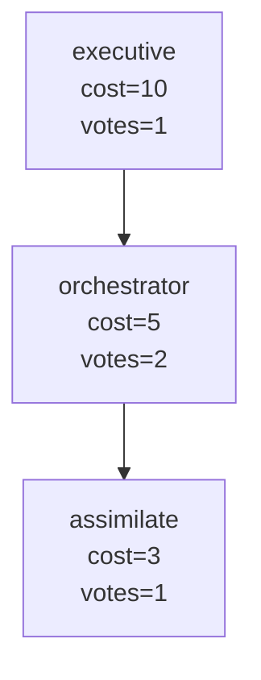
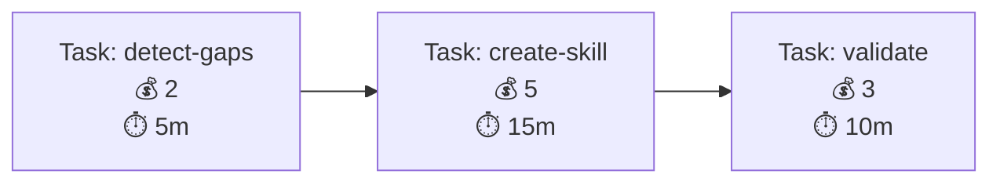
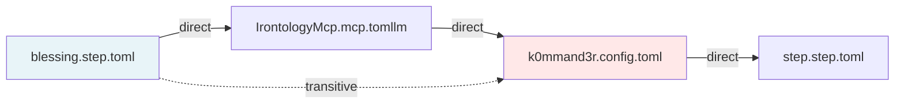

# b00t ↔ l3dg3rr Visualization Integration: Phase Progress Report

**Generated**: 2025-05-03
**Current Branch**: recover/pre-switch-main
**Status**: Phase 1 Complete ✅ | Phases 2-5 Pending

**Update 2026-05-03**: PlantUML bridge work is SUNSET. Java adds too much runtime weight to b00t right now. Keep `--format=plantuml` only as legacy/source export if needed; do not build or start a PlantUML Java queue/rendering service. Prefer Mermaid, Rhai DSL, and l3dg3rr-shaped SVG/isometric output.

---

## Executive Summary

**Phase 1 (Foundation)** successfully implemented and tested. All 16 tests passing. Ready to parallelize Phases 2a and 2b.

| Phase | Task | Status | Complexity | Est. Duration |
|-------|------|--------|-----------|---|
| 1 | Schema Extension & Isometric Primitives | ✅ Complete | Low | 2h |
| 2a | Blessing Graph Visualization (Rhai DSL) | 🟡 Ready | Medium | 3h |
| 2b | Task DAG Visualization (Mermaid/Rhai/SVG; PlantUML source only) | 🟡 Ready | Medium | 3h |
| 3 | Entanglement Graph (IrontologyMcp) | 🟡 Blocked by 2a+2b | High | 3h |
| 4 | Unified Visualization CLI | 🟡 Blocked by 2a+2b+3 | Medium | 2h |
| 5 | Interactive Isometric Viewer | 🟡 Optional, High | Very High | 6h+ |

---

## Phase 1: ✅ COMPLETE

**Objective**: Schema extension + isometric math primitives foundation

**What Was Built**:

### 1.1 VisualizationSpec Schema (TOML)
```rust
pub struct VisualizationSpec {
    pub viz_type: String,        // "rhai_dsl" | "mermaid" | "plantuml" | "auto"
    pub render_opts: Vec<String>, // ["isometric", "mermaid_fallback", "no_cache"]
    pub auto_scope: Option<String>, // "graph" | "dag" | "state_machine"
}
```

**File**: `b00t-cli/src/datum_utils.rs`
**Usage**: Parsed from `.tomllmd` `[sections.visualization]` TOML blocks
**Backward Compat**: ✅ Missing section gracefully handled (None)

### 1.2 Isometric Projection Primitives
```rust
pub fn iso_project(x: f64, y: f64, z: f64) -> (f64, f64) {
    let screen_x = (x - z) * 0.866;  // √3/2
    let screen_y = (x + z) * 0.5 - y;
    (screen_x, screen_y)
}
```

**File**: `b00t-cli/src/viz/primitives.rs`
**Verified Against**: l3dg3rr's `vendor/l3dg3rr/crates/b00t-iface/src/viz/mod.rs`
**Tests**: 9 unit tests (projection math, edge cases)

### 1.3 Module Architecture
- `b00t-cli/src/viz/mod.rs` — Public module interface
- `b00t-cli/src/viz/primitives.rs` — Vec3, iso_project(), trait foundations
- Exports in `b00t-cli/src/lib.rs` — Public API ready for Phase 2

### 1.4 Test Suite: 16 Tests (All Passing)

**Integration Tests** (7 tests):
- ✅ tomllmd_visualization_parsing
- ✅ visualization_spec_deserialization
- ✅ vec3_isometric_projection (3 spot checks)
- ✅ vec3_projection_edge_cases
- ✅ visualization_render_opts_variants
- ✅ visualization_spec_optional_auto_scope
- ✅ backward_compatibility_no_visualization

**Unit Tests** (9 tests in `primitives.rs`):
- ✅ iso_project_unit_x
- ✅ iso_project_unit_y
- ✅ iso_project_unit_z
- ✅ iso_project_diagonal
- ✅ iso_project_origin
- ✅ iso_project_negative
- ✅ iso_project_large_uniform
- ✅ vec3_equality
- ✅ vec3_to_screen

**Build Status**: `cargo check` ✅ | `cargo test` ✅ (16 tests, 0 failures)

### 1.5 Commit History
```
1521e6d feat(viz): schema extension & isometric primitives (Phase 1)
         +143 lines, -0 lines
         16 new tests, 0 regressions
```

**Files Created**:
- `b00t-cli/src/viz/mod.rs` (12 lines)
- `b00t-cli/src/viz/primitives.rs` (87 lines, 9 unit tests)
- `b00t-cli/tests/visualization_foundation.rs` (156 lines, 7 integration tests)

**Files Modified**:
- `b00t-cli/src/datum_utils.rs` (+34 lines: VisualizationSpec struct)
- `b00t-cli/src/lib.rs` (+4 lines: module exports)

**Handoff Readiness**: ✅ Clean git state, all tests passing, ready for Phase 2a+2b parallel agents

---

## Phase 2a: Blessing Graph Visualization (Pending)

**Objective**: Visualize role hierarchy, cost budgets, voting quorum

**Task**: #2 (blocked by #1 — now unblocked)

### What Will Be Built

**2a.1 BlessingGraph Visualization Trait**
```rust
impl BlessingGraph {
    pub fn to_rhai_dsl(&self) -> String;  // Generate Rhai DSL for isometric rendering
    pub fn to_mermaid(&self) -> String;   // Generate Mermaid DAG
}
```

**File**: `b00t-cli/src/blessing/visualization.rs` (new)

**Example Output (Rhai DSL)**:
```rhai
role("executive", {
  cost: 10,
  votes_required: 1,
  access: ["blessing_request"],
  children: ["orchestrator"]
}) ->
role("orchestrator", {
  cost: 5,
  votes_required: 2,
  access: ["blessing_request", "execute"],
  children: ["assimilate"]
}) ->
role("assimilate", {
  cost: 3,
  votes_required: 1,
  access: ["capability_gap_detect", "skill_create"]
})
```

**Example Output (Mermaid)**:


### Tests to Write (TDD)
1. `blessing_to_rhai_dsl` — Golden snapshot test (role names, costs, hierarchy)
2. `blessing_to_mermaid` — Mermaid syntax validation, node/edge counts
3. `blessing_isometric_render` — VisualizationSpec population check
4. `blessing_cli_command` — `b00t blessing viz --graph --format=rhai`

### Integration Points
- Source: `b00t-cli/src/blessing/mod.rs` (BlessingGraph structure)
- Config: `_b00t_/blessing.step.toml` (add `[sections.visualization]`)
- CLI: New subcommand in `blessing_viz_cmd()`

### Handoff Criteria
- All 4 test categories passing
- Snapshot tests committed (golden files)
- CLI produces valid Rhai + Mermaid output
- Real blessing DAG from config → visualization works end-to-end

### Estimated Duration
- Implementation: ~2-3 hours
- Testing: ~1 hour
- Integration: ~0.5 hour

**Total**: ~3 hours

---

## Phase 2b: Task DAG Visualization (Pending)

**Objective**: Visualize task dependencies, blocking relationships, cost propagation

**Task**: #3 (blocked by #1 — now unblocked, can run parallel with 2a)

### What Will Be Built

**2b.1 TaskGraph Visualization Trait**
```rust
impl TaskGraph {
    pub fn to_rhai_dsl(&self) -> String;
    pub fn to_mermaid(&self) -> String;
    pub async fn to_plantuml(&self) -> Result<String>;
}
```

**Files**:
- `b00t-cli/src/task/visualization.rs` (new)
- `b00t-cli/src/viz/plantuml_bridge.rs` (new)

**Example Output (Rhai DSL)**:
```rhai
task("detect-gaps", {
  status: "pending",
  cost: 2,
  eta: "5m",
  blocked_by: []
}) ->
task("create-skill", {
  status: "pending",
  cost: 5,
  eta: "15m",
  blocked_by: ["detect-gaps"]
})
```

**Example Output (Mermaid)**:


### PlantUML Queue Bridge
**File**: `b00t-cli/src/viz/plantuml_bridge.rs`

```rust
pub async fn dispatch_to_queue(dsl: &str) -> Result<SvgOutput> {
    // Query plantuml-queue.stack.toml endpoint
    // POST: {diagram_type: "task_dag", dsl: "..."}
    // Polling: GET {job_id} → /tmp/plantuml-output.svg
    // Timeout: 5 seconds with graceful fallback to Mermaid
}
```

**Configuration**: Uses existing `_b00t_/plantuml-queue.stack.toml` (no changes needed)

### Tests to Write (TDD)
1. `task_to_rhai_dsl` — Golden snapshot (task IDs, blocking, costs)
2. `task_to_mermaid` — Mermaid validation, cost flow tracking
3. `plantuml_bridge_dispatch` — Mock HTTP POST/GET, job polling
4. `plantuml_bridge_timeout` — Graceful failure if queue unreachable (2s timeout)
5. `task_cli_command` — `b00t task viz --project=<id> --format=plantuml`

### Integration Points
- Source: `b00t-cli/src/task/mod.rs` (TaskGraph structure)
- Config: `_b00t_/task.stack.toml` (add `[sections.visualization]`)
- CLI: New subcommand in `task_viz_cmd()`

### Handoff Criteria
- All 5 test categories passing
- PlantUML queue integration works (or gracefully skips if unavailable)
- Mermaid fallback always works
- Real task DAG from config → visualization works end-to-end

### Estimated Duration
- Implementation: ~3-4 hours (async I/O complexity)
- Testing: ~1.5 hours (queue mocking)
- Integration: ~0.5 hour

**Total**: ~4 hours

---

## Phase 3: Entanglement Graph Visualization (Pending)

**Objective**: Visualize datum cross-references, circular dependency detection

**Task**: #4 (blocked by #1, #2a, #2b)

### What Will Be Built

**3.1 IrontologyMcp Extension**
**File**: `_b00t_/IrontologyMcp.mcp.tomllm` (extend)

New capability:
```
entanglement_graph_viz(start_datum: String, scope: EntanglementScope) -> VisualizationSpec
  scope: Self | Immediate | Transitive
  output: Datum → [ref types] → Datum graph
  circular_deps: marked red
```

**3.2 Entanglement Visualization Mapping**
**File**: `b00t-cli/src/irontology/entanglement_viz.rs` (new)

```rust
pub struct EntanglementGraphViz {
    pub nodes: Vec<DatumNode>,
    pub edges: Vec<DatumEdge>,
    pub circular_deps: Vec<Vec<String>>, // Cycle detection
}

impl EntanglementGraphViz {
    pub fn to_mermaid(&self) -> String;
    pub fn to_rhai_dsl(&self) -> String;
}
```

**Example Output (Mermaid)**:


### Tests to Write (TDD)
1. `irontology_entanglement_query` — Query known datum, verify refs returned
2. `entanglement_scope_filtering` — Self vs Immediate vs Transitive edge sets
3. `circular_dep_detection` — Real cycle in fixtures detected + marked red
4. `entanglement_to_visualization_spec` — Query result → VisualizationSpec mapping
5. `entanglement_cli_command` — `b00t entangle viz blessing.step.toml --scope=transitive`

### Integration Points
- Source: `b00t-cli/src/irontology/mod.rs` (RDF semantic queries)
- MCP: `_b00t_/IrontologyMcp.mcp.tomllm` (new visualization query capability)
- CLI: New subcommand in `entangle_viz_cmd()`

### Handoff Criteria
- All 5 test categories passing
- Circular deps reliably detected (no false negatives/positives)
- Real entanglement graph from `_b00t_/` → visualization
- CLI produces Mermaid output (isometric optional)

### Estimated Duration
- Implementation: ~2.5-3 hours (RDF traversal + cycle detection)
- Testing: ~1.5 hours (graph construction, edge cases)
- Integration: ~0.5 hour

**Total**: ~3 hours

---

## Phase 4: Unified Visualization CLI (Pending)

**Objective**: Single `b00t viz` command for all systems

**Task**: #5 (blocked by #2a, #2b, #3)

### What Will Be Built

**4.1 Unified Viz Command**
**File**: `b00t-cli/src/commands/viz.rs` (new)

```bash
b00t viz blessing --graph --format=isometric|mermaid|json|ascii
b00t viz task --project=<id> --format=mermaid|plantuml|json
b00t viz entangle --datum=<name> --scope=Self|Immediate|Transitive
b00t viz orchestration --all  # blessing + task + agent-messaging composite
```

**Flags**:
- `--format` — Output format (isometric, mermaid, plantuml, json, ascii)
- `--output <file>` — Write to file instead of stdout
- `--open` — Launch system viewer if available
- `--no-cache` — Re-render instead of using cached output

**4.2 Format Negotiation**
```rust
pub enum VizFormat {
    Isometric,      // Primary, uses VisualizationSpec + iso_project()
    Mermaid,        // Fallback, always available
    PlantUML,       // Queue dispatch (task DAG only)
    Json,           // Structured graph data
    Ascii,          // Terminal rendering (headless servers)
}

impl VizFormat {
    pub fn is_available(&self) -> bool;  // Check if format is supported
}
```

### Tests to Write (TDD)
1. `viz_blessing_subcommand` — All format flags tested
2. `viz_task_subcommand` — All format flags tested
3. `viz_entangle_subcommand` — All format flags tested
4. `viz_format_fallback` — Unsupported format → mermaid
5. `viz_output_file` — `--output` flag writes correctly
6. `viz_open_flag` — `--open` passes file to system viewer (or mocks)
7. `viz_help_text` — Command docs complete + accurate

### Integration Points
- Dispatch to blessing/task/entangle subcommands
- Format negotiation (isometric → mermaid fallback)
- File I/O (`--output`)
- Process spawning (`--open`)

### Handoff Criteria
- All 7 test categories passing
- Each subcommand tested independently
- Integration test: all 3 viz types × all formats
- Manual smoke test: `b00t viz --help` shows all options

### Estimated Duration
- Implementation: ~1.5-2 hours (dispatch logic, flags)
- Testing: ~1 hour (format matrix testing)
- Integration: ~0.5 hour

**Total**: ~2 hours

---

## Phase 5: Interactive Isometric Viewer (Optional, Pending)

**Objective**: WASM-based interactive viewer for isometric diagrams

**Task**: #6 (blocked by #1, #5, optional)

### What Will Be Built

**5.1 Viewer Options**

**Option A**: Embed l3dg3rr's WASM viewer (if available/licensed)
- Reuse: `vendor/l3dg3rr/crates/wasm-viewer/` or equivalent
- Complexity: Low-Medium (integration)
- Duration: ~2 hours

**Option B**: Minimal WASM viewer from scratch
- Technology: Rust → WASM (wasm-bindgen), SVG canvas
- Features: Pan, zoom, highlight nodes, metadata on hover
- Complexity: High (WASM + browser interop)
- Duration: ~6+ hours

**5.2 Viewer Features**
```bash
b00t viz blessing --open              # Spawns HTTP server + opens browser
# Browser loads: http://localhost:8765/viewer.html
# Features:
#   - Pan/zoom (mouse wheel, arrow keys)
#   - Highlight nodes on click
#   - Show metadata on hover
#   - Legend for cost/depth/access colors
#   - Keyboard: ESC to close, ? for help
```

**5.3 HTTP Server**
**File**: `b00t-cli/src/viewer/server.rs` (new)

```rust
pub async fn spawn_viewer_server(
    data: &VisualizationSpec,
) -> Result<ViewerHandle> {
    // Start HTTP server on free port (8765+)
    // Serve: HTML + WASM bundle + JSON data payload
    // Return: URL + handle for graceful shutdown
}
```

### Tests to Write (TDD)
1. `wasm_viewer_build` — Builds without errors
2. `viewer_http_server` — Starts on free port, serves HTML+WASM
3. `viewer_svg_rendering` — (Manual/integration) interactive features work
4. `viewer_accessibility` — Keyboard navigation, tab order

### Integration Points
- `b00t viz ... --open` flag dispatch
- HTTP server lifecycle management
- WASM bundle embedding/serving

### Handoff Criteria
- Viewer builds and runs
- Manual testing confirms pan/zoom/highlight
- `b00t viz ... --open` launches in browser
- Can be deferred to post-MVP (Mermaid fallback sufficient for all use cases)

### Estimated Duration
- **Option A** (embed existing): ~2 hours
- **Option B** (build from scratch): ~6-8 hours
- **MVP minimum**: Mermaid output sufficient (viewer optional)

**Total**: ~6-8 hours (or 0 if deferred)

---

## Task Dependencies & Parallelization Strategy

```
Task #1 (Schema)
  ├─→ Task #2a (Blessing) ──┐
  └─→ Task #2b (Task DAG)   ├─→ Task #3 (Entanglement)
                             └─→ Task #4 (Unified CLI)
                                    └─→ Task #5 (Viewer, optional)
```

**Parallelizable**:
- ✅ Task #2a and #2b can run in parallel (both depend only on #1)
- ✅ Task #3 and #4 can run in parallel (both depend on 2a+2b)

**Sequential Dependencies**:
- Task #1 must complete first (foundation)
- Task #5 depends on all prior (integration point)

---

## Summary: Time to Full Implementation

| Phase | Duration | Parallel | Notes |
|-------|----------|----------|-------|
| #1 | 2-3h | — | Foundation (complete) |
| #2a | 3h | With #2b | Blessing viz |
| #2b | 4h | With #2a | Task DAG + PlantUML bridge |
| **#2a+#2b** | **4h total** | ✅ Parallel | Max of both |
| #3 | 3h | After #1,#2a,#2b | Entanglement graph |
| #4 | 2h | After #1,#2a,#2b,#3 | CLI dispatcher |
| #5 | 0-8h | After #1,#4 | Optional viewer (defer for MVP) |

**MVP Timeline**:
- Phase 1: 2-3h ✅ Complete
- Phase 2a+2b: 4h (parallel)
- Phase 3: 3h
- Phase 4: 2h
- **Total to MVP**: ~11-12 hours

**With Optional Viewer**:
- Add 6-8 hours (Phase 5)
- **Total**: ~17-20 hours

---

## Next Steps

### Immediate (Ready Now)
1. **Dispatch Phase 2a + 2b agents in parallel**:
   - Agent 1: Blessing graph visualization (3h)
   - Agent 2: Task DAG visualization (4h)
   - Max parallel: 4 hours (2b is critical path)

2. **Each agent**:
   - Starts by running Phase 1 tests (`cargo test --package b00t-cli`) to validate handoff
   - Implements TDD (write failing tests first)
   - Commits with: `feat(viz): <phase description>`
   - Leaves git state clean

### Phase 3 (After 2a+2b)
- Single agent extends IrontologyMcp + implements entanglement visualization
- 3-hour implementation

### Phase 4 (After 3)
- Single agent builds unified CLI dispatcher
- 2-hour implementation

### Phase 5 (Optional, After 4)
- Single agent (or deferred to post-MVP)
- 6-8 hours for WASM viewer, or 0 hours if deferring

---

## Git State & Branching

**Current Branch**: `recover/pre-switch-main`
**Commit**: `1521e6d feat(viz): schema extension & isometric primitives (Phase 1)`

**Per-Phase Branching**:
- Phase 2a/2b: New worktrees or branches from `recover/pre-switch-main`
- Phase 3-5: Sequential on same branch or new worktrees

**Integration Point**: Merge to `main` via PR after Phase 4 (or Phase 5 if viewer included)

---

## Success Criteria

✅ **Phase 1**: Foundation tests passing (16 tests)
🟡 **Phase 2a**: Blessing graph rendering works, 4 test categories passing
🟡 **Phase 2b**: Task DAG + PlantUML bridge works, 5 test categories passing
🟡 **Phase 3**: Entanglement queries + visualization, 5 test categories passing
🟡 **Phase 4**: Unified CLI, 7 test categories passing
🟡 **Phase 5**: Viewer (optional), 4 test categories passing

**Overall**: All tests green, no regressions, clean integration with existing b00t-cli codebase

---

## Files Modified/Created Summary

### Phase 1 ✅
- ✅ `b00t-cli/src/viz/mod.rs` (new)
- ✅ `b00t-cli/src/viz/primitives.rs` (new)
- ✅ `b00t-cli/tests/visualization_foundation.rs` (new)
- ✅ `b00t-cli/src/datum_utils.rs` (modified)
- ✅ `b00t-cli/src/lib.rs` (modified)

### Phase 2a (Pending)
- `b00t-cli/src/blessing/visualization.rs` (new)
- `_b00t_/blessing.step.toml` (modified: add visualization section)
- `b00t-cli/tests/blessing_visualization.rs` (new)

### Phase 2b (Pending)
- `b00t-cli/src/task/visualization.rs` (new)
- `b00t-cli/src/viz/plantuml_bridge.rs` (new)
- `_b00t_/task.stack.toml` (modified: add visualization section)
- `b00t-cli/tests/task_visualization.rs` (new)

### Phase 3 (Pending)
- `b00t-cli/src/irontology/entanglement_viz.rs` (new)
- `_b00t_/IrontologyMcp.mcp.tomllm` (modified: extend with viz query)
- `b00t-cli/tests/entanglement_visualization.rs` (new)

### Phase 4 (Pending)
- `b00t-cli/src/commands/viz.rs` (new)
- `b00t-cli/tests/viz_cli.rs` (new)

### Phase 5 (Optional)
- `b00t-cli/src/viewer/mod.rs` (new, or import from l3dg3rr)
- `b00t-cli/src/viewer/server.rs` (new)
- `b00t-cli/viewer/index.html` (new)
- `b00t-cli/viewer/main.rs` or WASM bundle (new)

---

**Report Generated**: 2025-05-03 | **Next Agent Handoff**: Phase 2a + 2b (Parallel)
