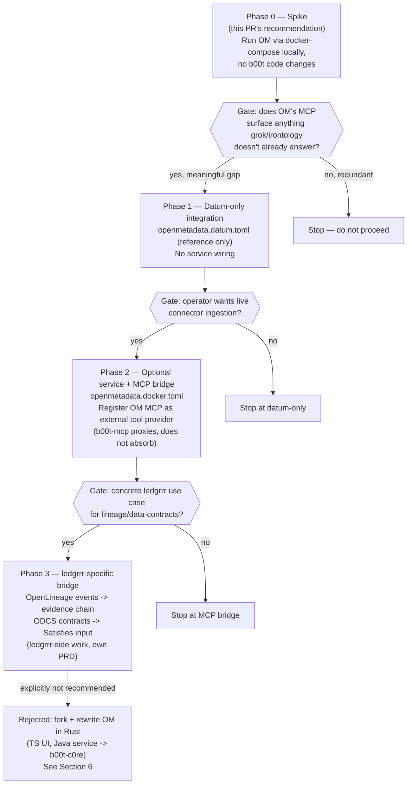

# PRD-012: OpenMetadata as Context Layer — Venn Analysis & Phased Adoption Plan

**Status:** Proposed — planning/analysis only, no implementation in this PR
**Date:** 2026-08-09
**Priority:** unlabeled (EPIC) — treated here as a scoping exercise, not a green light
**Issue:** closes #789 (planning phase only)
**Branch:** `task/789-openmetadata-context-layer-plan`

## 0. Scope of this document

Issue #789 is an EPIC whose own title asks for "venn analysis + 4-phase plan," not for
a working integration. This PR delivers exactly that: a verified comparison of
[OpenMetadata](https://github.com/open-metadata/OpenMetadata) against b00t's existing
datum/store system, an honest venn, and a phased adoption plan with go/no-go gates.
**No OpenMetadata integration code is written here.** If the plan below is approved,
each phase becomes its own tracked issue before any code lands.

## 1. What OpenMetadata is (verified, not taken on faith)

Checked directly against the upstream repo (`gh api repos/open-metadata/OpenMetadata`)
rather than trusting the issue draft's numbers:

| Claim | Verified value |
|---|---|
| Description | "The Open Context Layer for Data and AI — the open platform for building trusted data context and business semantics for humans, AI assistants, and agents." |
| Stars | 14,793 (issue draft said "14.5k" — consistent, minor drift) |
| Primary language | TypeScript (UI); service is Java, ingestion SDK is Python — matches draft |
| MCP server | Yes, ships a built-in MCP server (confirmed via project docs) |
| Connectors | 130+ source connectors (DBs, BI tools, pipelines, ML platforms) |

The self-description overlapping "context layer for AI" with b00t's own framing is real,
not a stretch — this is the strongest argument for taking the EPIC seriously.

## 2. Does anything like this exist in b00t already?

`grep -ri openmetadata` across the entire workspace (all crates, all `_b00t_/*.toml`
datums, all docs) returns **zero hits**. No prior integration, spike, or datum exists.
This is a clean-slate proposal — Path A ("already done") does not apply.

## 3. Venn: OpenMetadata ∩ b00t ∩ ledgrrr

```
                        ╔═══════════════════════════╗
                        ║      OpenMetadata          ║
                        ║  ─────────────────────     ║
                        ║  130+ connectors            ║
                        ║  Data quality / profiling    ║
                        ║  Column-level lineage         ║
                        ║  ODCS 3.1 data contracts       ║
                        ║  React UI                       ║
                        ║        ┌─────────────────────┐  ║
                        ║        │   OVERLAP ZONE       │  ║
                        ║        │  Knowledge graph      │  ║
                        ║        │  MCP server           │  ║
                        ║        │  Semantic search      │  ║
                        ║        │  Memory/tribal notes   │  ║
                        ║        │  Governance/policy      │ ║
                        ╚════════╪═════════════════════╪═══╝
                 ┌───────────────┘                     └──────────────┐
                 │  b00t                                     ledgrrr  │
                 │  ──────────────────────────                ─────── │
                 │  irontology_bridge.rs (HelixDB              │
                 │    default / Oxigraph / legacy Neumann)      Rhai rules engine
                 │  113 hand-authored *.datum.toml files         Evidence/audit graph
                 │  grok (RAGLight semantic search)               Mermaid/isometric viz
                 │  b00t-mcp (compile-time CLAP→MCP tools)         Typed ontology graph
                 │  lfmf / learn/ tribal-knowledge datums
                 │  reviewer/ governance + gate_result.rs
                 └───────────────────────────────────────────────────┘
```

Reading the venn: the **overlap zone is real but narrow** — knowledge graph, MCP
surfacing, semantic search, memory, and lightweight governance all have working b00t
(and partial ledgrrr) equivalents today. OpenMetadata's actual differentiators —
connectors, data-quality/profiling, column lineage, formal data contracts, and a
browsable UI — are things **b00t has none of**, and none of ledgrrr's evidence-graph
work substitutes for them either.

## 4. Capability matrix (corrected)

The original issue draft's matrix is substantially accurate. Two corrections after
reading the current source instead of relying on memory:

| Capability | OpenMetadata | b00t (verified) | Correction from draft |
|---|---|---|---|
| Knowledge graph store | Entity/relationship graph, lineage | `irontology_bridge.rs` — **HelixDB is now the compiled default** (`store-helixdb` feature); Oxigraph is the alternate embedded-SPARQL backend; NeumannStore is `#[deprecated]`/archived | Draft said "NeumannStore/Oxigraph" — outdated, HelixDB replaced Neumann as default |
| Datum count | 130+ connectors (comparable unit: source integrations) | **29** `*.datum.toml` files in `_b00t_/` as of this branch (`find _b00t_ -iname '*.datum.toml' \| wc -l`; other branches carry more — this repo has many in-flight worktrees) | Draft's "~50" is in the right ballpark but branch-dependent; cite the live count, not a fixed number |
| `DatumType` variants | N/A | 36 variants in `b00t-cli/src/datum_types.rs` | Draft said "~30" — close enough, no change needed |
| MCP server | Built-in, 10+ tools, Python/Java service | `b00t-mcp` — Rust, compile-time CLAP→MCP dispatch | Overlap confirmed real |
| Semantic search | Graph + vector hybrid, server-side | `grok` command (RAGLight integration, see `b00t-cli/src/commands/grok.rs`) | Overlap confirmed real |
| Governance | Policies, roles, glossaries, schema-driven | `b00t-c0re-lib/src/reviewer/{governance,evidence}.rs`, `gate_result.rs` | Overlap confirmed real, b00t's is code-driven not schema-driven |
| Data quality/profiling | Tests, freshness, observability | **None** | Confirmed gap |
| Column-level lineage | OpenLineage-based | **None** | Confirmed gap — closest ledgrrr analog is its evidence/audit graph, which is provenance-for-transactions, not schema lineage |
| Data contracts | ODCS 3.1 import/export | **None** | Confirmed gap |
| Storage | MySQL/PostgreSQL + Elasticsearch, server-based | TOML files + embedded graph store (HelixDB/Oxigraph) + SQLite | Architecture mismatch is real: OM assumes a always-on service, b00t assumes local-first CLI/embedded state |
| UI | Full React dashboard | CLI + TUI, no web UI | Confirmed gap |

## 5. Phased adoption plan

Compressed from the issue draft's 4 phases (1–2, 2–4, 3–6, 6–12 sprints) to 3 phases
with explicit gates. **Phase 4 ("fork OpenMetadata, strangler-fig rewrite UI to Rust
and service to Rust") is downgraded from a plan phase to a rejected option** — see §6.



### Phase 0 — Spike (no b00t code changes)
Run OpenMetadata via its published docker-compose against the sandbox or a local
throwaway instance. Compare its MCP tool responses against `grok`/`b00t-mcp` on the
same 5–10 real b00t questions (e.g. "what datums exist for X", "what's the lineage of
this decision"). This is the cheapest possible falsification test for the entire EPIC
and should happen **before** any of the phases below get their own tracked issue.

### Phase 1 — Datum-only integration (small, reversible)
`_b00t_/openmetadata.datum.toml` recording what it is, links, and spike findings —
same pattern as every other reference datum in the store. No docker, no service, no
MCP wiring. This is pure documentation-as-datum and costs almost nothing.

### Phase 2 — Optional service + MCP proxy bridge (medium effort, reversible)
Only if Phase 0's spike shows OM answers real questions grok/irontology can't:
stand up OM as an optional `_b00t_/openmetadata.docker.toml` service, register its MCP
server as an **external proxy tool provider** in `b00t-mcp` (b00t-mcp already has a
proxy pattern — `b00t-mcp/src/proxy_mcp_tools.rs`). Explicitly proxy, not absorb: OM
keeps its own storage and process; b00t-mcp forwards calls. Reversible by removing the
proxy registration.

### Phase 3 — ledgrrr-specific bridge (larger, needs its own PRD)
Only with a concrete ledgrrr use case in hand (e.g. an actual tax-evidence or
transaction-provenance need that OpenLineage/ODCS solves better than ledgrrr's own
evidence graph). This phase is ledgrrr's to scope, not b00t's, and should be filed as
its own PRD against the ledgrrr repo if Phase 2 proves the bridge is worth having.

## 6. Rejected: fork + strangler-fig rewrite

The original issue draft's Phase 4 proposed forking OpenMetadata and rewriting its
TypeScript UI and Java service into Rust (`b00t-ui-wasm`, `b00t-c0re`) over 6–12
sprints. This is rejected as a plan phase, not merely deferred:

- It commits to absorbing and maintaining a 14.8k-star, three-language, actively
  developed project's entire surface area before Phase 0's spike has even shown the
  overlap is worth bridging.
- b00t's own operating law is DRY + "search first, fork-fix-forward when you find a
  bug" — not "fork wholesale and rewrite in a different language" as a default
  posture toward a healthy upstream project.
- If specific OM components (e.g. its lineage engine) prove valuable and upstream is
  unresponsive to a real bug/gap, fork-fix-forward on that *component*, not the whole
  platform.

## 7. Risks

- **Architecture mismatch**: OM assumes an always-on multi-service deployment
  (MySQL/Postgres + Elasticsearch + Java service); b00t is local-first/CLI-first.
  Even the Phase 2 proxy bridge adds an operational dependency b00t doesn't otherwise
  have.
- **Redundant surface**: the overlap-zone capabilities (graph, MCP, semantic search,
  governance) already work in b00t today. Absent Phase 0 evidence, Phase 2+ risks
  building a second answer to a question b00t already answers.
- **Scope creep magnet**: as an EPIC with no assigned priority, this can silently
  absorb sprints without gates. The gate diagram in §5 exists specifically to prevent
  that.

## 8. Recommendation

Proceed with **Phase 0 only** as an immediate, cheap, reversible next step. File
Phase 1/2/3 as separate tracked issues **only after** Phase 0's spike produces
evidence one way or the other — do not pre-approve the later phases now. This
matches the EPIC's own framing (a plan, not a mandate) and keeps the "big EPIC" size
from becoming grounds for either over-scoping or dismissing it outright.
