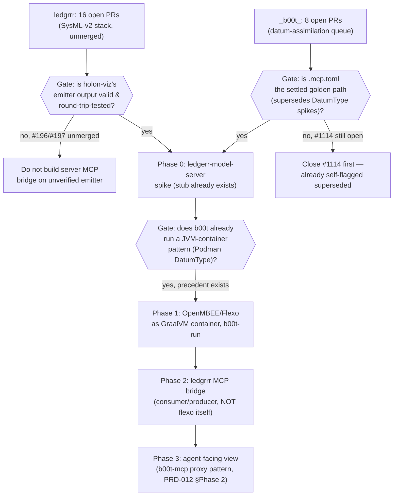
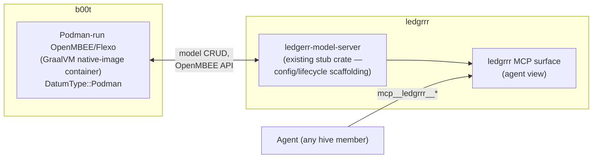

# PRD-013: Backlog Clearance + Local ledgrrr Server (EPIC)

**Status:** Proposed — planning document, sub-tasks not yet filed as issues
**Date:** 2026-08-23
**Priority:** EPIC — gated phases, not a green light for all sub-tasks at once
**Depends on:** PRD-012 (OpenMetadata venn analysis, Phase 0 recommendation still
unactioned), `docs/sysml-v2-tooling-survey.md` (ledgrrr, decisions already made),
`_b00t_#1121` (AGENTS.md SysML-v2 + b00t-mcp mandate, merging)
**Branch:** `docs/prd-013-ledgrrr-server-backlog-epic`

## 0. Scope of this document

This is the EPIC-level plan requested after a single session surfaced three
compounding problems: (1) two independent agents duplicating work because closed-vs-
merged PR status wasn't cross-checked, (2) a multi-hour CI outage caused by two
self-hosted runners sharing an identical label with different host state, and (3) a
fast-growing, uncoordinated SysML-v2 spike backlog in `ledgrrr` that a new "local
ledgrrr server" EPIC would otherwise land on top of blind. This document does not
implement anything itself — it inventories the real backlog (verified via `gh`, not
recalled), states why clearing it gates the new server work, and phases the server
work itself. Each phase becomes its own tracked issue only after its gate is met,
matching PRD-012's convention.

## 1. Situation summary (verified this session)

| Event | Repo | Verified outcome |
|---|---|---|
| `common-core#48` (deep-link validator) | app4dog | Closed as duplicate — byte-identical to already-merged `#46` modulo `rustfmt`. Confirmed via direct diff, not recalled. |
| `puppyplay-godot-droid#92` (Custom Tabs handoff) | app4dog | Closed — merging would have **regressed** `main`, which already had a more complete version (`FamilyLinkBridge` GDExtension, full consent flow) via `#90`/`#91`. Confirmed via two-dot diff against the actual merge base, not the misleading three-dot diff. |
| Runner-label collision | app4dog/workspace CI | Two self-hosted runners (`app4dog-fung1`, containerized; `sm3llsl1k3s0ld3r`, bare-metal, different physical host) both carried the generic `app4dog` label, so GitHub interleaved jobs between hosts with different `postgresql`/`postgis` package state. Root-caused jointly with a second agent operating on `sm3llsl1k3s0ld3r` (real-time NATS coordination, `nats://192.168.1.137:4222`); fixed via an additive per-host label + a workflow fix that resolves the PostGIS package from whichever cluster is actually bound to `:5432`, not the highest version `apt-cache` can see. `workspace#142` merged, both hosts green. |
| SysML-v2 epic | ledgrrr | **16 open PRs**, almost all opened 2026-08-21/22 (`#179`–`#197`), covering: tooling survey (`#180`), re-scope (`#181`), `sysml-derive` spike (`#183`), `ZLayer::SystemsModel` (`#185`), `ArtifactKind` widening (`#184`), `reqif-opa-mcp` spike (`#186`), parser round-trip spike (`#187`), README re-framing (`#188`), pilot conformance oracle spike (`#189`), viz wiring (`#190`), DVC defer (`#191`), `JournalTransaction` (`#192`), `SysmlBlock` retrofit (`#193`), two `holon-viz`/`sysml-derive` output-validity fixes (`#196`, `#197`), plus an unrelated `ledgerr-cloud` GPU-budget PR (`#179`). None merged yet. |
| Datum-assimilation queue | `_b00t_` | **8 open PRs**, several stacked/overlapping: MCP-database sync (`#1109`), two datum-assimilation PRs (`#1105`, `#1108`), a vendored skill (`#1115`), a superseded spike explicitly flagged in its own title (`#1114`, "see #1110, `.mcp.toml` is the actual path"), two live Cloudflare Worker features (`#1119`, `#1120`), and this session's own `#1121`. |
| app4dog org | 7 repos | **4 open PRs total**, all green/mergeable — the one org that got fully cleared this session. |

**Read on the numbers:** app4dog's backlog is small because this session actively
worked it down to zero, one PR at a time, with each closure/merge individually
verified. `ledgrrr` and `_b00t_` have not had that pass — 24 open PRs combined,
concentrated in exactly the subsystem (`holon-viz`/SysML-v2, MCP datum registry) that
the new "local ledgrrr server" EPIC would extend. Standing up new server
infrastructure on an unmerged, unstable base multiplies the surface area an agent has
to reconcile before anything works end-to-end.

## 2. Why backlog-clearing gates the new EPIC (dependency argument)

The two gates on the left (`B`, `D`) are backlog items, not new work — they already
have open PRs against them. `#196`/`#197` fix exactly the emitter-validity question
Phase 0 needs answered; `#1114` is a spike explicitly superseded by the decision
already recorded in `feedback_mcp_toml_golden_path.md`-equivalent tribal knowledge
and should be closed, not left open to confuse the next agent that greps for "sysml
lsp datum" and finds two conflicting proposals. Neither gate requires new design —
both are "finish or close what's already there."

## 3. Pre-maintenance phase — Definition of Done

A repo/subsystem is "tidy" (ready to build the new EPIC on) when:

1. **Zero PRs whose own title/body says "superseded"/"deferred"/"see #X instead"
   remain open.** (`#1114` today.) Close with a comment linking the superseding
   decision — do not silently delete, the history is the audit trail.
2. **Every open PR has a stated next action**, not just a stale review-request. A PR
   sitting for >24h with CI green and no comment is either mergeable now or blocked on
   something that should be written down.
3. **No two open PRs modify the same file with contradictory intent.** (`ledgrrr`'s
   `#196`/`#197` both touch `holon-viz`'s SysML-v2 emitter — verify they're additive,
   not competing, before either merges.)
4. **The subsystem's own survey/decision doc (if one exists, e.g.
   `docs/sysml-v2-tooling-survey.md`) is up to date with what actually merged**, not
   what was proposed.

This is a checklist, not a new process — apply it once per subsystem before starting
Phase 0 of any EPIC that extends it.

## 4. Ways of working (codified from what worked this session, not invented fresh)

- **Verify before closing-as-duplicate.** Diff the actual content (two-dot, against
  current `main`, not three-dot against a stale merge-base) before assuming "looks
  similar" means "safe to close." Cost this session: near-miss on `#92` would have
  regressed `main` if the diff had been skipped.
- **`gh run rerun --failed`, not host patches**, for self-hosted CI flakiness — but
  confirm *which* runner actually executed the job first (`gh api .../jobs/<id> -q
  .runner_name`) before assuming a host-level fix applies. Two runners with identical
  labels made this session's diagnosis take 3x longer than it should have; the fix
  (`_b00t_` label + `workspace#142`'s version-matching logic) is now in place so this
  specific failure mode can't recur.
- **Cross-agent coordination over a real channel, not relayed chat paraphrase.** The
  NATS hive channel (`hive.sm3ll-fung1.*`) let two agents divide labor (host-state vs.
  workflow-file) without duplicating the CI fix — extend this pattern rather than
  defaulting to "user relays messages between two sessions."
- **Don't re-derive another repo's architecture in this file** — AGENTS.md already
  states this rule for `ledgrrr`; PRD-013 follows it by pointing at `ledgrrr`'s own
  survey doc rather than restating its contents.
- **A closed-as-duplicate/superseded PR needs a comment stating why**, so the next
  agent that finds it via `gh pr list --state closed` doesn't have to re-derive the
  reasoning from scratch.

## 5. Sub-task breakdown (yak-shaving, dependency-ordered)

| # | Task | Repo | DoD | Depends on | Suggested owner |
|---|---|---|---|---|---|
| 1 | Close `_b00t_#1114` with a comment linking `#1110`/`.mcp.toml` decision | `_b00t_` | PR closed, comment posted, no orphaned branch | none — actionable now | sm0l agent |
| 2 | Triage `ledgrrr` PRs `#183`–`#197`: merge, request-changes, or close each with a stated reason | `ledgrrr` | 0 open PRs left with no comment in >24h; `#196`/`#197` conflict-checked against each other first | none — actionable now | ch0nky agent, one PR at a time (per this session's explicit "fix one at a time" precedent) |
| 3 | Verify `docs/sysml-v2-tooling-survey.md` reflects what actually merged from #2 | `ledgrrr` | Doc diff reviewed, stale claims corrected | #2 complete | frontier agent (judgment call on doc accuracy) |
| 4 | Triage `_b00t_` datum-assimilation PRs `#1105`, `#1108`, `#1109`, `#1115` for overlap (do any two assimilate the same upstream source?) | `_b00t_` | Each PR merged or closed with reason; no duplicate datum names | #1 complete (frees reviewer attention) | sm0l agent (mechanical dedup check), escalate overlaps to frontier |
| 5 | Clone remaining PromptExecution-owned vendor modules into `~/promptexecution/` (see §7 list) alongside `just-mcp`/`ledgrrr`'s existing precedent | n/a (filesystem) | Each module has a top-level clone on `main`, dotfiles' `vendor/*` submodule pins untouched | none — actionable now, low risk (additive clones) | sm0l agent |
| 6 | Write `blessed.toml`-pattern entries (per session's earlier "blessed in ~/.b00t" decision) for the modules cloned in #5 | `_b00t_` | One `.repo.toml` per module with `status = "blessed"`, discoverable via `b00t datum search blessed --types repo` | #5 complete | sm0l agent |

## 6. EPIC: local ledgrrr server, orchestrated by b00t

**Architecture, as directed:** `ledgrrr` is the MCP-facing consumer/producer client
and agent-facing view into systems-model state. `ledgrrr` is **not** Flexo/OpenMBEE —
it does not implement the SysML-v2/KerML modeling engine itself. `b00t` owns running
the actual OpenMBEE/Flexo-SysMLv2 service (per the tooling survey's existing rule:
JVM-heavy tooling runs as a GraalVM native-image container, never a host install).
`ledgrrr` talks to that service as a client and re-exposes relevant state over its own
MCP surface for agents.

This is **not** greenfield: `ledgerr-model-server` already exists in the `ledgrrr`
workspace (`crates/ledgerr-model-server`, described in its own `Cargo.toml` as a
"Local MCP model server stub — configuration, lifecycle, and future MSI scaffolding").
Phase 0 below extends that stub rather than starting a new crate.

### Phase 0 — Spike: OpenMBEE/Flexo as a b00t-run container (blocked on §5 task 2 gate)

Stand up OpenMBEE/Flexo-SysMLv2 via Podman, following the existing
`DatumType::Podman` pattern (`podman kube play`, no Docker per this org's standing
rule). No `ledgrrr` code changes. Gate: does it actually run and expose a usable API
locally? This is the direct analog of PRD-012's Phase 0 (cheapest possible
falsification test before committing further phases).

### Phase 1 — `ledgerr-model-server` talks to the container

Extend the existing stub to make real calls against the Phase 0 container — config
and lifecycle only, matching the crate's stated scope. Gate: can `ledgerr-model-server`
start/stop/query the container without manual `podman` commands?

### Phase 2 — MCP bridge (agent view)

Register `ledgerr-model-server`'s capabilities as an MCP surface, following the
proxy pattern already established for `b00t-mcp` (per PRD-012 §5 Phase 2:
"b00t-mcp proxies, does not absorb"). Gate: can an agent query model state through
`mcp__ledgrrr__*` and get an answer that matches the container's own API response?

### Phase 3 — ledgrrr-side model semantics (own PRD)

Anything beyond raw proxying — e.g. reconciling OpenMBEE's model format with
`ledgrrr`'s own typed ontology graph — is `ledgrrr`'s own scope decision and should be
filed as its own PRD in that repo once Phase 2 proves the bridge is worth extending,
matching PRD-012 §5 Phase 3's precedent exactly.

## 7. Vendor → first-class promotion list (from this session's "blessed module" decision)

Already done: `ledgrrr` cloned to `~/promptexecution/ledgrrr` (on `main`), alongside
the pre-existing `~/promptexecution/just-mcp` precedent. Candidates for the same
treatment (PromptExecution-owned, per `~/.dotfiles/.gitmodules` — excludes
externally-owned vendor entries like `microsoft/agent-framework` or
`oraios/serena`):

`codebase-memory-mcp-b00t-ir0n-ledg3rr`, `embed-anything-b00t`, `hermes-agent-b00t`,
`irontology-mcp`, `llama-patch`, `opencode-b00t`, `rust-docs-mcp-b00t`,
`gemm-common`, `tomllm`, `agentsea-skillpacks`, `android-emulator-container-scripts`,
`opencode-goal-plugin`, `aohp`, `runpod-sdk`.

Not yet actioned — sub-task #5 in §5 above. Each is a low-risk additive clone (the
dotfiles submodule pin is untouched), so this can proceed in parallel with the PR
triage tasks.

## 8. Risks

- **Triage-as-busywork risk**: closing/merging 24 PRs across two repos is real review
  effort, not free housekeeping. Route sm0l-tier mechanical checks (does this PR's own
  title already say "superseded") separately from frontier-tier judgment calls (does
  `#196` conflict with `#197`) so the expensive tier isn't spent on the cheap check.
- **Runner-collision recurrence**: the label fix resolves *this* instance; if a third
  self-hosted runner is added later with the same generic label, the failure mode
  returns. Worth a standing check (`gh api .../actions/runners` diff on unique labels)
  rather than a one-time fix.
- **Scope creep on the server EPIC**: per PRD-012's own risk section, an EPIC with
  gated phases can still silently absorb sprints if the gates aren't actually checked
  before proceeding. Phase 0 here is deliberately container-only, no `ledgrrr` code —
  do not start Phase 1 before Phase 0's spike is verified working.

## 9. Recommendation

Execute §5 sub-tasks 1 and 5 immediately (both are zero-judgment, low-risk, and
actionable right now). Route sub-tasks 2 and 4 (PR triage) to dedicated agent passes,
one repo at a time, following this session's own "fix one at a time" pattern rather
than batching. Do **not** start EPIC Phase 0 (§6) until §5 tasks 1–4 are complete —
the gates in §2's diagram are backlog items, not new design work, and clearing them
is strictly cheaper than reconciling conflicts discovered mid-EPIC.
