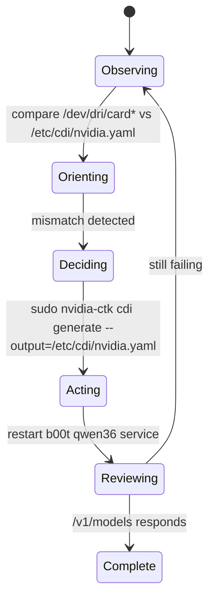

# nvidia-cdi-gpu

Use this datum when Podman GPU workloads fail because the CDI spec no longer matches the host DRM node.

This requirement is now attached to GPU datums through `[[b00t.requirements]]`, so capability solving can detect CDI drift before the service launch path.

Typical symptom on this node:

```text
failed to stat CDI host device "/dev/dri/card0": no such file or directory
```

Another deterministic failure signature on this node:

```text
json: unknown field "additionalGids"
```

Current host state observed during validation:

- host DRM node: `/dev/dri/card1`
- host render node: `/dev/dri/renderD128`
- stale CDI spec was still pointing at `/dev/dri/card0`

## OODA loop



## Deterministic checks

Observe:

```bash
printf 'host: '; ls /dev/dri/card*
printf '\ncdi: '; grep -o '/dev/dri/card[0-9]\+' /etc/cdi/nvidia.yaml | sort -u
```

Parser-compatibility check:

```bash
grep -nE '^[[:space:]]*additionalGids:' /etc/cdi/nvidia.yaml
```

If that regex matches, the current Podman/CDI parser path is expected to fail before the workload starts.

Act:

```bash
b00t install nvidia-cdi-gpu
```

Review:

```bash
systemctl --user restart b00t-hive-inference-qwen36-35b-a3b-llamacpp.service
curl -sf http://127.0.0.1:8001/v1/models
```
