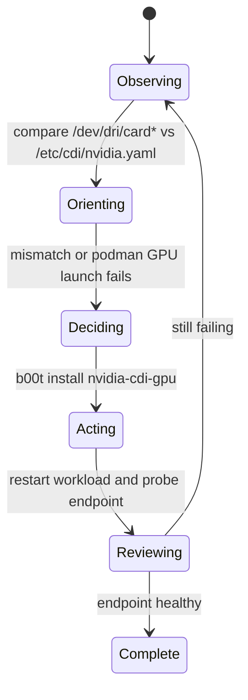

# quadlet-podman-kube

`b00t install quadlet-podman-kube` installs the node pattern used on this host:

- `systemd --user` owns service lifecycle
- `quadlet` turns `.kube` files into services
- `podman kube play` runs the actual workload YAML

The datum now declares machine-readable requirements in `[[b00t.requirements]]`, including:

- `runtime.podman`
- `runtime.systemd-user`
- `runtime.cgroup-v2`

Installed layout:

```text
~/.config/containers/systemd/
├── b00t-kube@.kube
├── b00t-kube/
│   ├── <name>.yaml
│   └── examples/hello-pod.yaml
└── README-b00t-kube.txt
```

Workflow:

1. Put a pod manifest at `~/.config/containers/systemd/b00t-kube/<name>.yaml`
2. Instantiate the quadlet template:
   `ln -sfn b00t-kube@.kube ~/.config/containers/systemd/b00t-kube@<name>.kube`
3. Reload and start:
   `systemctl --user daemon-reload`
   `systemctl --user start b00t-kube@<name>.service`

This keeps the pattern declarative: YAML is the workload contract, quadlet is the systemd adapter, and Podman is the runtime.

Use `sudo loginctl enable-linger $USER` if you want rootless workloads to survive outside an active login session.

## GPU workloads: OODA drift handling

If the workload uses Podman GPU CDI, treat `/etc/cdi/nvidia.yaml` as node state that can drift from the live `/dev/dri/card*` device names.



On this node the observed drift was: stale CDI referenced `card0`, host exposed `card1`.
