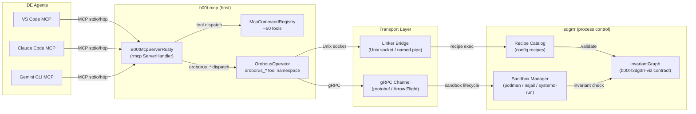

# Orobous Operator — Lightweight SDD

**Design Doc** for a b00t-mcp-based operator that exposes ledgrrr's deterministic process control as MCP tools, with gRPC/linker separation of concerns.

---

## 1. Architecture

The oroborus pattern decouples process orchestration (b00t-mcp) from process execution (ledgrrr) via a gRPC/linker transport layer. The operator is a **thin Rust crate** (`b00t-oroborus-op`) that registers as a tool namespace on b00t-mcp and proxies requests to ledgrrr.



### Separation of Concerns

| Layer | Responsibility | Process |
|-------|---------------|---------|
| **b00t-mcp** | Tool registry, ACL, transport (stdio/HTTP) | `b00t-mcp` binary |
| **Orobous Operator** | Tool namespace `oroborus_*`, gRPC/linker proxy logic | Registered in `McpCommandRegistry` |
| **Linker Bridge** | Low-latency recipe dispatch via Unix socket | `just` recipes, CLI wrappers |
| **gRPC Channel** | Structured sandbox lifecycle (create/exec/destroy) | tonic + protobuf |
| **ledgrrr** | Recipe evaluation, sandbox isolation, invariant validation | `ledgerr-mcp-server` / `ledgrrr` CLI |

---

## 2. Tool Surface

The operator exports 7 MCP tools under the `oroborus_` prefix, mapping directly to ledgrrr's deterministic process control verbs (mirroring `VisualizationRole` from `b00t-l3dg3rr-viz`):

### Process Lifecycle Tools

| MCP Tool | Ledgrrr Verb | Description | Input Schema |
|----------|-------------|-------------|--------------|
| `oroborus_monitor` | Ingest | Watch a ledgrrr recipe namespace for state changes | `namespace: String`, `watch_secs: Option<u32>` |
| `oroborus_validate` | Validate | Validate an invariant graph against a recipe | `recipe_id: String`, `graph_json: String` |
| `oroborus_classify` | Classify | Classify a process state by ledgrrr ontology | `state_snapshot: String`, `ontology: Option<String>` |
| `oroborus_review` | Review | Review a sandbox execution trace for policy compliance | `sandbox_id: String`, `policy_ref: Option<String>` |
| `oroborus_reconcile` | Reconcile | Reconcile two invariant graph states | `expected_graph: String`, `actual_state: String` |
| `oroborus_commit` | Commit | Finalize a deterministic process execution | `session_id: String`, `approval: String` |
| `oroborus_sandbox_exec` | Step | Execute a recipe inside a sandbox context | `recipe: String`, `sandbox_type: String`, `timeout_secs: Option<u32>` |

### Tool Naming Convention

Following the existing `b00t_<category>_<cmd>` pattern from `McpCommandRegistry::search_tools()`, where category is the second token (e.g., `b00t_mcp_list` -> category `mcp`). The operator adds category `oroborus`.

Each tool accepts JSON-encoded arguments (MCP standard) and returns structured JSON with fields: `success`, `output`, `error` (if any), and `ledgrrr_trace_id` for audit linkage.

---

## 3. Transport

The operator uses **both** transport strategies, selected by configuration:

### Linker Bridge (default for local, low-latency)

- **Protocol**: Unix domain socket at `~/.b00t/run/oroborus.sock`
- **Message format**: Newline-delimited JSON (NDJSON)
- **Security**: File-system permissions (`0600`), owner-only
- **Use case**: Recipe dispatch, invariant validation, sandbox exec on local metal
- **Implementation**: `tokio::net::UnixListener` in the operator, `UnixStream` in ledgrrr adapter

### gRPC Channel (remote / cloud / Arrow Flight)

- **Protocol**: gRPC over TCP with TLS (via tonic + prost)
- **Service definition** (proto sketch):

```protobuf
service OrobousOperator {
  rpc Monitor(MonitorRequest) returns (stream MonitorEvent);
  rpc Validate(ValidateRequest) returns (ValidateResponse);
  rpc Classify(ClassifyRequest) returns (ClassifyResponse);
  rpc Review(ReviewRequest) returns (ReviewResponse);
  rpc Reconcile(ReconcileRequest) returns (ReconcileResponse);
  rpc Commit(CommitRequest) returns (CommitResponse);
  rpc SandboxExec(SandboxExecRequest) returns (SandboxExecResponse);
}
```

- **Data format**: Apache Arrow (via Arrow Flight gRPC) for bulk state snapshots
- **Use case**: Cloud/SaaS ledgrrr deployment (`ledg3rr`), cross-host sandbox orchestration

### Transport Selection

```toml
# ~/.b00t/_b00t_/oroborus-op.mcp.toml
[b00t]
name = "oroborus-op"
type = "mcp"
hint = "Orobous operator — ledgrrr process control via MCP"

[b00t.providers.transport]
# 'linker' (Unix socket) or 'grpc' (TCP/TLS)
prefer = "linker"
fallback = "grpc"
linker_socket = "~/.b00t/run/oroborus.sock"
grpc_endpoint = "localhost:8432"
connect_timeout_sec = 5
```

---

## 4. Integration with Existing b00t-mcp

### Option A: New Rust crate registered in McpCommandRegistry (recommended)

The operator lives in a **new workspace crate** `b00t-oroborus-op/` with:

1. **OrobousTool structs** — clap `#[derive(Parser)]` structs for each tool (following the pattern in `mcp_tools.rs`)
2. **`impl_mcp_tool!` macro invocations** — registering `oroborus_*` tool names
3. **Plugin registration** — a `register_oroborus_operator()` function called from `create_mcp_registry()` in `mcp_tools.rs`:

```rust
// In create_mcp_registry():
builder
    .register::<OrobousMonitorCommand>()
    .register::<OrobousValidateCommand>()
    // ... etc
```

This requires adding `b00t-oroborus-op` as a workspace dependency in the root `Cargo.toml`.

### Option B: Standalone subprocess with b00t-mcp proxy (lighter coupling)

The operator runs as a separate binary (`b00t-oroborus-op`) registered as an MCP sub-server via the existing `McpRegistry` / `GenericMcpProxy`. b00t-mcp discovers and proxies through it.

**Recommendation**: Start with Option B for P0 (zero coupling, can ship fast), migrate to Option A for P2 (compile-time safety, in-process latency).

### b00t-cli Integration

Add a subcommand:

```
b00t-cli oroborus <verb> [args]
```

Where `<verb>` is `monitor`, `validate`, `classify`, `review`, `reconcile`, `commit`, `sandbox-exec`. This mirrors the MCP tool surface exactly, following `b00t-cli`'s clap-first convention.

---

## 5. Datum Model

The operator role datum declares which agents, CLIs, and MCP servers are entangled, following the existing `.role.toml` pattern:

```toml
# ~/.b00t/_b00t_/oroborus-op.role.toml
[b00t]
name = "oroborus-op"
type = "role"
hint = "Orobous operator: deterministic process control via ledgrrr gRPC/linker bridge."

skills = [
    "ledgrrr-recipe-dispatch",
    "sandbox-lifecycle",
    "invariant-graph-validation",
    "oroborus-tool-namespace",
    "focus-record-route",
]

compliance = [
    "Route all process monitor/validate/classify through ledgrrr invariant graph",
    "Never execute sandbox without validate gate",
    "Commit requires reconcile verification",
    "Use linker for local, gRPC for remote — never both simultaneously on same session",
]

entangled_agents = [
    "ralph.agent",
    "worker.agent",
]

entangled_cli = [
    "b00t.cli",
    "just.cli",
    "ledgrrr.cli",
]

entangled_mcp = [
    "b00t-mcp.mcp",
    "ledgrrr-mcp.mcp",
    "oroborus-op.mcp",
]

depends_on = [
    "ledgrrr-mcp.mcp",
    "memory.mcp",
]

keywords = ["role", "operator", "oroborus", "ledgrrr", "process-control", "sandbox", "invariant"]

[b00t.agent_hooks]
events = [
    "oroborus.monitor",
    "oroborus.validate",
    "oroborus.classify",
    "oroborus.review",
    "oroborus.reconcile",
    "oroborus.commit",
    "oroborus.sandbox-exec",
]
gates = [
    "validate-invariant-graph",
    "check-recipe-exists",
    "verify-sandbox-type",
]
validations = [
    "post-commit-graph-consistency",
]

[b00t.providers.transport]
prefer = "linker"
fallback = "grpc"
linker_socket = "~/.b00t/run/oroborus.sock"
grpc_endpoint = "localhost:8432"
connect_timeout_sec = 5
stream_type = "dataframe"
```

---

## 6. Implementation Phases

### Phase 1: Foundation (P0 — weeks 1-2)

- [ ] Create `b00t-oroborus-op/` workspace crate with `Cargo.toml` using `version.workspace = true`
- [ ] Implement `OrobousSandboxExecCommand` as first tool — Parser struct + `impl_mcp_tool!`
- [ ] Set up linker transport: Unix socket listener in `~/.b00t/run/oroborus.sock`
- [ ] Wire `just` recipe dispatch through the linker (shell exec)
- [ ] Register tool in `create_mcp_registry()` — add to builder chain
- [ ] Create `oroborus-op.mcp.toml` and `oroborus-op.role.toml` datums
- [ ] End-to-end test: `b00t-cli oroborus sandbox-exec` runs a recipe

### Phase 2: Complete Tool Surface (P1 — weeks 3-4)

- [ ] Implement remaining 6 tools (monitor, validate, classify, review, reconcile, commit)
- [ ] Wire `b00t-l3dg3rr-viz` InvariantGraph validation into `oroborus_validate`
- [ ] Implement `b00t-cli oroborus` subcommand for all verbs
- [ ] Add handshake integration: operator reads `~/.b00t/mesh/ledgrrr.handshake` (reuses `check_peer_handshake()` from OODA)
- [ ] Write integration tests using the existing test patterns in `b00t-mcp/src/mcp_tools.rs`

### Phase 3: gRPC & Production (P2 — weeks 5-6)

- [ ] Add gRPC transport via `tonic` + `prost` — implement the `OrobousOperator` proto service
- [ ] Arrow Flight support for bulk state snapshots
- [ ] Transport auto-detection (linker preferred, fallback to gRPC)
- [ ] ACL-aware tool filtering (extend existing `AclFilter` for `oroborus_*` namespace)
- [ ] Polyseme-aware routing: local request → linker, cloud request → gRPC (`ledg3rr`)
- [ ] Benchmark: latency comparison linker vs gRPC for sandbox exec

---

## Appendix: Files Changed

| File | Change |
|------|--------|
| `Cargo.toml` (workspace) | Add `b00t-oroborus-op` member + workspace dep |
| `b00t-oroborus-op/src/lib.rs` | New crate — tool structs + executor impls |
| `b00t-oroborus-op/src/linker.rs` | Unix socket transport |
| `b00t-oroborus-op/src/grpc.rs` | gRPC client (optional feature) |
| `b00t-mcp/src/mcp_tools.rs` | Import + register oroborus tools in `create_mcp_registry()` |
| `b00t-cli/src/main.rs` | Add `oroborus` subcommand |
| `~/.b00t/_b00t_/oroborus-op.mcp.toml` | New datum — MCP server config |
| `~/.b00t/_b00t_/oroborus-op.role.toml` | New datum — role entanglement |

**Version constraint**: All new crates use `version.workspace = true` — no hardcoded versions.

---

## 7. `!` Exec Mode — Intercept, Authorize, Log, Return

The `!` prefix on any b00t shell command triggers the oroborus exec pipeline:

```
! <command> [args]       → intercept + route through ledgrrr
```

### Flow

```
Hermes Agent
  │
  ├── sends `! make build` to b00t shell
  │
  ▼
b00t Shell (`!` prefix detector)
  │
  ├── 1. Intercept: parse `! <cmd> [args]`, reject raw bash
  │      Build OrobousExecRequest { command, args, env, cwd }
  │
  ▼
ledgrrr (oroborus gate)
  │
  ├── 2. Gate: apply dynamic rules to command
  │      - Check recipe catalog for pre-approved pattern
  │      - Apply sandbox constraints (timeout, filesystem, network)
  │      - Log request to process task checklist → advance step counter
  │
  ├── 3a. ALLOW → issue authorization token
  │        └── token + command forwarded to b00t-cli
  │
  ├── 3b. DENY → log rejection, return error to Hermes
  │
  ├── 3c. REVIEW → queue for human/interactive approval
  │        └── ledgrrr notifies Hermes with pending auth request
  │
  ▼
b00t-cli (authenticated executor)
  │
  ├── 4. Execute command via duct / std::process::Command
  │      - Pass auth token as env var: B00T_AUTH_TOKEN=<token>
  │      - Capture stdout/stderr/exit_code
  │
  ▼
ledgrrr (result processor)
  │
  ├── 5. Log result: stdout, stderr, exit_code, duration, trace_id
  │      - Append to process task step checklist
  │      - If step was the last in checklist → auto-advance to next instruction
  │      - Update process state DAG
  │
  ├── 6. Route output:
  │      - Success → deterministic result → Hermes agent
  │      - Error → diagnose + summarize per instruction rules
  │        └── Error Summary: { command, exit_code, stderr_summary,
  │             suggested_fix, pre_approved_retry? }
  │
  ▼
Hermes Agent
  │
  ├── Receives structured result: { stdout, exit_code, trace_id,
  │     step_advanced, next_steps }
  │
  └── Codifies rules → ledgrrr recipe catalog (pre-approve for next time)
```

### Authorization Token Model

```
OrobousAuthToken {
    version: 1,
    command_hash: blake3(command_string),
    scope: ["shell.exec", "oroborus.sandbox_exec"],
    expiry_unix: <now + 60s>,
    recipe_id: Option<String>,       // pre-approved recipe match
    max_duration_ms: 30_000,
    allowed_exit_codes: [0, 130],    // 130 = SIGINT (ctrl-c)
}
```

The token is generated by ledgrrr's auth gate, passed to b00t-cli via `B00T_AUTH_TOKEN` env var. b00t-cli refuses to execute `!` commands without a valid token, preventing unauthorized shell access.

### Process Task Step Checklist

Each `!` command execution creates/advances a step in the current process DAG:

```
Checklist Entry {
    step_id: uuid_v7,
    command: "make build",
    status: "running" | "completed" | "failed" | "skipped",
    trace_id: blake3(step_id + command),
    authorized_by: "ledgrrr" | "interactive",
    started_at: unix_ns,
    completed_at: Option<unix_ns>,
    result: Option<ExecResult>,
}
```

ledgrrr maintains the checklist as an ordered DAG. When a step completes, if it was the last uncompleted step, the operator auto-advances to the next instruction set (signals Hermes via MCP notification). This creates the "until control returns to b00t then Hermes" loop.

### Pre-Approved Recipe Catalog

ledgrrr's recipe catalog stores vetted command patterns:

```toml
[[b00t.recipe]]
name = "cargo-check"
pattern = "^cargo check( --manifest-path [^ ]+)?( -p [^ ]+)?$"
auto_approve = true
sandbox_type = "none"           # cargo check is safe
max_duration_ms = 300_000
allowed_exit_codes = [0]

[[b00t.recipe]]
name = "make-build"
pattern = "^make( -j\\d+)?( build| test)?$"
auto_approve = false            # human review first time
sandbox_type = "podman-nsjail"
max_duration_ms = 600_000
allowed_exit_codes = [0, 1, 2]

[[b00t.recipe]]
name = "cargo-build-release"
pattern = "^cargo build --release( -p [^ ]+)?$"
auto_approve = true
sandbox_type = "systemd-run --user --scope"
max_duration_ms = 600_000
allowed_exit_codes = [0]
```

Once a recipe is auto-approved and completes successfully N times (configurable, default 3), its rules can be codified into the ledgrrr invariant graph for fully automatic execution — no token round-trip needed. Hermes receives the result deterministically as if it were a direct tool call, but with full audit trail.

### Implementation note

The `!` prefix detection lives in `b00t-cli`'s main shell loop (`b00t-cli/src/main.rs`), not in the MCP path. b00t-mcp agents (Claude Code, etc.) send `!` commands as tool calls; the shell intercepts via regex on the command string before `duct::cmd()` dispatch. The oroborus gate runs as a pre-exec hook installed by the `oroborus-op.role.toml` datum.
