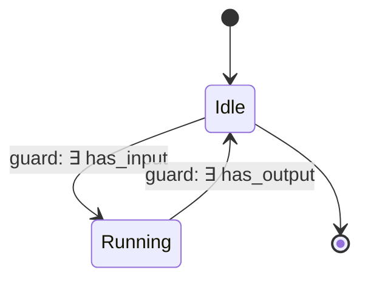

# Hive Process Documentation Skill

Generate visual SysMLv2/KerML-compatible process documentation from hive pipeline nodes.

## When to use

When the user asks to visualize hive processes, document pipeline flows, generate state machine diagrams, check system health, or export process models for SysMLv2/KerML tooling.

## NRA Principle

NEVER REINVENT ANYTHING. This skill leverages existing infrastructure:
- `b00t-admin` server → `/api/admin/health`, `/api/admin/processes`
- `pipeline_nodes` crate → `NodeGraph`, `StateMachine`, `PipelineNode`
- `b00t-cli` → `hive status`, `doctor_cmd::health_json()`

## Quick Reference

| Action | Command |
|--------|---------|
| Health metrics | `curl http://localhost:31337/api/admin/health` |
| Process graph (JSON) | `curl http://localhost:31337/api/admin/processes` |
| Process graph (Mermaid) | `curl -s http://localhost:31337/api/admin/processes \| jq -r '.mermaid'` |
| Process graph (SVG) | Generated from NodeGraph via `to_svg()` |
| State machines | `curl http://localhost:31337/api/admin/processes \| jq '.nodes[].state_machine'` |
| Type inspector | `curl http://localhost:31337/api/admin/types` |
| Hive status | `b00t hive status` |
| Container health | `systemctl --user status b00t-admin` |

## Running the server

```bash
# Native
LLM_BACKEND_URL=http://localhost:5273 ADMIN_PORT=31337 cargo run -p b00t-admin

# Container (auto-restart via quadlet)
just b00t-admin quadlet-install
systemctl --user start b00t-admin
```

## Health Metrics

`GET /api/admin/health` returns:
```json
{
  "status": "operational",
  "service": "b00t-admin",
  "version": "0.8.3",
  "uptime": "12:34:56 up 3 days, ...",
  "cpu": { "logical_cores": 16, "load_avg": "0.52 0.38 0.41" },
  "memory": "...free -h output...",
  "timestamp": "2026-06-20T12:00:00Z"
}
```

## Process Documentation

`GET /api/admin/processes` returns NodeGraph JSON for all 4 pipeline stages with:
- Node metadata (id, label, category, ports, style)
- FOL contracts (preconditions, postconditions, invariants)
- State machines (FOL-guarded transitions)
- Mermaid export (inline for rendering)
- ComfyUI workflow export

### SysMLv2/KerML Mapping

| Pipeline Concept | SysMLv2 | KerML |
|-----------------|---------|-------|
| `PipelineNode<I,O>` | `PartDefinition` | `PartDefinition` |
| `Compose<A,B>` | `Connection` | `ConnectionUsage` |
| `StateMachine` | `StateMachine` | `StateDefinition` |
| `StateTransition` + guard | `Transition` with `guard` | `TransitionUsage` with `ConstraintUsage` |
| `FOLFormula` | `Constraint` | `ConstraintDefinition` |
| `NodeGraph` | `BlockDefinitionDiagram` | `ViewDefinition` |
| `NodeStyle.shape` | `NodeSymbol` | `Appearance` |

## Visual Export Formats

| Format | Endpoint/Command | Use Case |
|--------|-----------------|----------|
| Mermaid | `curl .../api/admin/processes \| jq '.mermaid'` | GitHub README, docs |
| SVG | `NodeGraph::to_svg()` | Dashboards, embedding |
| ComfyUI JSON | `NodeGraph::to_comfyui_workflow()` | Visual editors |
| JSON | `curl .../api/admin/processes` | API consumption, tools |

## State Machine Documentation

Each pipeline node has an `Idle → Running → Idle` cycle with FOL-guarded transitions:



Guard assertions are first-order verifiable:
- `∃ input: has_input(input) → enter Running`
- `∃ output: has_output(output) → return to Idle`

## Integration with b00t-server Dashboard

Open http://localhost:31337/ to see:
- Pipeline Status panel
- Type Explorer
- Process Flow (SVG)
- Twin Simulation
- Live health metrics via WebSocket

## Verification

```bash
# Health check
curl http://localhost:31337/health
# → {"status":"ok","service":"b00t-admin","version":"0.8.3",...}

# Process documentation
curl -s http://localhost:31337/api/admin/processes | python3 -m json.tool | head -20

# State machine inspection
curl -s http://localhost:31337/api/admin/processes | jq '.nodes[0].state_machine.states'
```
